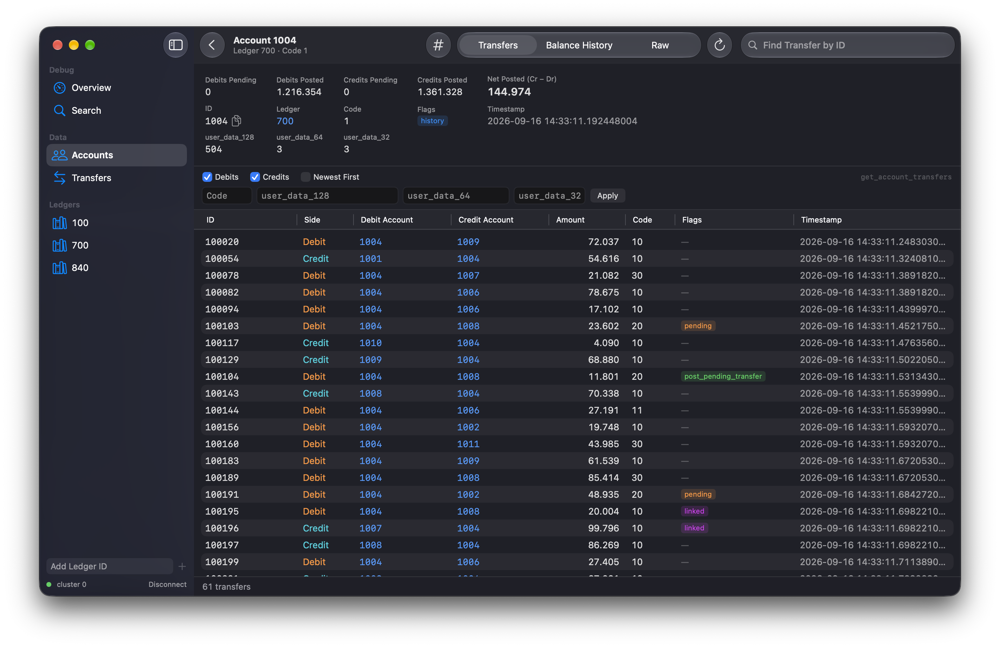

# TigerBeetle Explorer

A native macOS app for browsing [TigerBeetle](https://tigerbeetle.com) clusters: ledgers, accounts, transfers, balance history, and pending → post/void chains.

**Website:** [golobitch.github.io/tb-explorer](https://golobitch.github.io/tb-explorer/)

**Read-only.** The app never issues `create_accounts` or `create_transfers`, and CI enforces this.

It's written in SwiftUI and talks to TigerBeetle through the official C client (`tb_client`), linked in as a static library. There's no bundled server or helper process. The app is macOS only and requires macOS 15.



## Version compatibility

The TigerBeetle client is compiled into the app and must be compatible with the server. A mismatch appears in the connection list and the app refuses to connect.

| TigerBeetle Explorer | tb_client | TigerBeetle server |
| -------------------- | --------- | ------------------ |
| 0.0.x                | 0.17.9    | 0.17.9             |

The TigerBeetle client protocol doesn't expose the server's release number. The app knows its own client version and reports a mismatch when the cluster evicts the client with *release too low* or *release too high*.

## Features

- **Connections**: a list of saved connections (name, cluster id, replica addresses, last used). They're stored as JSON in the app's Application Support container.
- **Overview**: cluster id, client version, a live latency check, and discovered ledgers. TigerBeetle can't list ledgers, so the app collects them from every account and transfer it loads. You can also add a ledger id by hand from the sidebar.
- **Ledger**: `query_accounts` filtered by ledger, with optional code and user_data filters. Results are paginated by timestamp cursor, load more as you scroll, and can be sorted newest first.
- **Account**: all fields and decoded flags, plus these tabs:
  - **Transfers**: `get_account_transfers`, filtered to debits and/or credits.
  - **Balance History**: `get_account_balances` as a Swift Charts step chart with exact values on hover, plus a table. Double-click a row to open the transfer that produced it. Accounts without the `history` flag show an explicit empty state.
  - **Raw**: every field, copyable.
- **Transfer**: all fields, links to both accounts, and the chain:
  - For a post or void transfer: the pending transfer it references.
  - For a pending transfer: its status (posted, voided, expired or pending). The app finds it by scanning later debit-account transfers within a bounded lookback, and **Search Wider** extends the scan tenfold.
  - For a linked transfer: every member of its linked group.
- **Search**: paste an id (the app detects account vs transfer), or query by ledger, code, user_data_128/64/32 and time range.
- **Readable amounts**: TigerBeetle stores amounts as integers and ledgers as bare numbers. With **Currency Format** on (the checkbox next to *Newest First*, and in Settings), the ledger id is read as an ISO 4217 numeric code, so ledger 840 shows `123456` as `1.234,56 $` and appears as `840 · USD`. The exact integer stays one hover away, and ledgers that aren't currencies stay raw. Settings ⌘, overrides the name, symbol and decimals per ledger, and names the numeric `code` values (`10 · payment`); overrides are stored per connection in `metadata.json`.
- **Windows and links**: ⌘N opens another window on the same connection, so two accounts can sit side by side. Each window keeps its own sidebar selection and history; the connection, saved connections and discovered ledgers are shared. **Copy Link** gives a `tb-explorer://transfer/100539?cluster=0` link for the thing you're looking at — from an id's context menu, a table row, a ledger in the sidebar, or the account and transfer toolbars. Opening one lands in the window you're already in. The cluster is part of the link because ids are only unique within a cluster: a link from a different cluster is refused with an explanation rather than resolving a different object with the same id. A link names a place, never how to reach it — it carries no addresses, and opening one never connects. If you aren't connected yet, the link waits until you are.
- **Export**: every list — accounts, transfers, balance history — exports to CSV or JSON, either the rows already loaded (⇧⌘E) or the whole result set (⌥⇧⌘E), which re-runs the query and pages to the end with a count and a Cancel. Amounts and ids are written as **exact integers**, and JSON writes them as strings: the largest number JSON represents exactly is 2⁵³, so a u128 id parsed as a number comes back with its low digits rewritten. Readable columns (`amount_formatted`, `ledger_name`, `code_label`) are opt-in per export via a checkbox in the save panel, and timestamps always carry both nanoseconds and UTC ISO 8601. A JSON export also records which cluster and query it came from. Cancelling deletes the partial file.
- **Settings** (⌘,): **General** sets what to connect to at launch (nothing, by default), whether to reopen the last location, rows per page, and how far a transfer screen scans for a post or void. **Formats** is the ISO 4217 pane described above.
- **Throughout**: ⌘K opens Go to ID, ⌘F focuses the filter row, ⌘[ and ⌘] go back and forward. ids have Copy / Copy as Hex context menus, and the Go menu has keyboard shortcuts. Light and dark mode follow the system.

ids, amounts and user_data are Swift `UInt128` / `UInt64` end to end, with no strings or floating point. Currency formatting is exact too: the decimal point is inserted into the digit string, so a 39-digit `UInt128.max` survives it. The one exception is the balance chart, which plots `Double`; its hover readout and tables show exact values.

### Why the wire format is decoded by hand

Swift can't import C struct fields of type `__uint128_t`, so TBKit reads and writes TigerBeetle's extern structs at the byte offsets defined in `tb_client.h`. `WireTests` pins the sizes and offsets against the C header.

## Development

Prerequisites: Xcode 16.3+ and [XcodeGen](https://github.com/yonaskolb/XcodeGen) (`brew install xcodegen`). The Xcode project is generated from `project.yml` and isn't committed.

```sh
make open            # generate TBExplorer.xcodeproj and open it in Xcode
```

Then press **⌘R**. The scheme's Run pre-action (`scripts/dev-cluster.sh`) makes sure a dev cluster is up on `127.0.0.1:3000` before the app launches. If nothing is listening, it downloads TigerBeetle 0.17.9, formats a data file, starts the replica in the background, and seeds it when the data file is new. The Debug app then connects to it automatically. The cluster keeps running after you stop the app. Pre-action output goes to `.tigerbeetle/dev-cluster.log`, since Xcode doesn't show it.

From the terminal:

```sh
make tb-up           # same as the pre-action: start (and seed if new) in the background
make tb-stop         # stop the replica using this repo's data file
make tb-reset        # stop and delete the data file; the next tb-up reseeds
make tb-start        # run a replica in the foreground instead
```

The seed data is deterministic and idempotent. It includes:

- 40 pending→post transfers (some partial)
- 25 pending→void transfers
- 15 expired pendings
- 10 never-resolved pendings
- linked groups of 3
- accounts with and without `history`
- varied codes and user_data

Useful ids: accounts `1001`–`1020`, transfers `100001` and up.

Debug builds accept launch arguments that connect and open a screen directly. The scheme already passes `-TBConnect 127.0.0.1:3000`; to also open a screen, add `-TBOpen` under Edit Scheme → Run → Arguments, or run from the terminal:

```sh
open "build/DerivedData/Build/Products/Debug/TigerBeetle Explorer.app" --args -TBConnect 127.0.0.1:3000 -TBOpen transfer:100011
```

`-TBOpen` takes several comma-separated steps to build up a history, and `-TBBack`/`-TBForward` then walk it. `-TBWindows 2` opens a second window, `-TBLink` delivers a deep link, `-TBCopyLink account:1015` prints the link the Copy Link action would produce, and `-TBSnapshot <name>` draws the window to a PNG and quits (`-TBSnapshotStdout` prints it as base64 instead, since the app is sandboxed; `-TBSnapshotWindow <title>` picks which window). `-TBExport transfers:loaded:csv` writes an export into the app container and prints it as `EXPORT:` lines — the sandbox allows no other readable destination — and `…:all:csv:cancel` checks that a cancelled export leaves no file behind. Every setting is an ordinary `UserDefaults` key, so `-general.rowsPerPage 5` and `-export.formatted YES` work the same way.

Snapshots need the display awake: a directly launched app cannot create a window while the screen is asleep, so prefix a run with `caffeinate -u -t 3`.

Deep links need the app registered with LaunchServices. For a build in `DerivedData`:

```sh
/System/Library/Frameworks/CoreServices.framework/Frameworks/LaunchServices.framework/Support/lsregister \
  -f "build/DerivedData/Build/Products/Debug/TigerBeetle Explorer.app"
open "tb-explorer://transfer/100011?cluster=0"
```

### Tests

```sh
make test            # unit + integration tests (⌘U in Xcode); the Test pre-action ensures the cluster
```

### Build

```sh
make release         # universal (arm64 + x86_64) Release build
```

Pushing a `v*` tag runs the release workflow, which publishes a zipped app and `SHA256SUMS`. The app is signed with a Developer ID and notarized when the `MACOS_*` / `APPLE_*` secrets are set; without them it's ad-hoc signed.

### Upgrading TigerBeetle

1. `make vendor TB_VERSION=X.Y.Z` refreshes `tb_client.h` and the universal `libtb_client.a`.
2. Update `TBClient.clientVersion`, `TB_VERSION` in the `Makefile`, and `.github/workflows/ci.yml`.
3. Run `make integration`, then add a row to the compatibility table.

## Layout

```
project.yml                 XcodeGen spec (app, TBKit, tests, tb-seed)
docs/images/                screenshots used by this README
website/                    landing page (Astro), deployed to GitHub Pages by the pages workflow
Vendor/tigerbeetle/         tb_client.h, module map, universal libtb_client.a, VERSION
Sources/TBKit/              read-only Swift client over tb_client
  TBClient.swift            async submit, packet lifetimes, timeouts, errors
  Wire.swift                explicit encoding of TigerBeetle structs
  Queries.swift             lookups, queries, account transfers/balances, connect/ping
  Chain.swift               pending resolution and linked groups
  Models.swift, U128.swift  models, flags, filters, UInt128 parsing/formatting
Sources/TBExplorer/         SwiftUI app
Tests/TBKitTests/           Swift Testing unit + integration suites
Tools/tb-seed/              seeds a dev cluster (the only code that creates)
```
